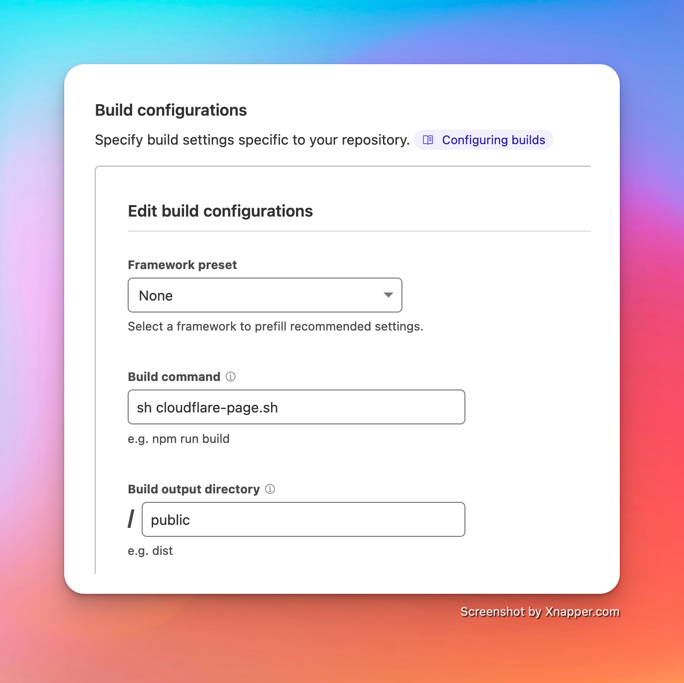

# Lina PHP - lightweight and blazing fast static blog generator

**Lina** is an opinionated flat-file CMS for who want a simple and fast blog. Lina uses Blade template engine, so you can use all Blade features.

## Features
- **Blazing fast**: Lina is a lightweight and superfast static blog generator.
- Written in PHP: so if you hate Javascript, Lina is for you.
- Blade template engine: you can use all Blade features.'
- Minimalistic: Lina is a static blog generator. It's not a full-fledged CMS.
- Deploy everywhere! You know, just html files 🤣

## Requirements
- PHP 8.3

## Getting started
There are some ways to install Lina:

Require Lina as dependency, with this option, you can keep lina up-to-date easily.
```bash
mkdir my-blog
composer init # then follow the instructions
composer require bangnokia/lina
./vendor/bin/lina new . # scaffolding a new blog skeleton in the current directory
./vendor/bin/lina serve # start a development server and happy writing
```

Or install Lina as global composer package
```bash
composer global require bangnokia/lina
lina new my-blog
lina serve
```


## Folder structure
In case you want to migrate from another blog platform, you can check the base structure of Lina
```
content/
    posts/
        2020-11-01-hello.md
    index.md
resources/
    views/
        index.blade.php
        post.blade.php
public/ 
    images/
    style.css
```


- `content` directory is where you store your markdown content file.
- `resources/views` directory is where you store your blade template.
- `public` directory is where you store your assets like images, css, ... This folder is also where all the generated files are stored. So please remember to add your custom files to `.gitignore` if you want to store them in `git`

**We really recommend you to prefix your content file with the date, so it will easy to sort and find your content. Lina automatically strip the date from the slug, so you don't need to worry about the url.**

## Helper functions
There are some functions that you can use to programmatically access your content.

### Get all content in a directory

Get all the content in a directory. The content will be sorted by the date in the filename.
```php
foreach (lina()->index('post') as $post) {
    echo $post->title;
}
```

### Get a single content

```php
$post = lina()->get('posts/2020-11-01-hello.md');
```

## Deployments
Lina can be deployed to any static hosting provider. Here are some examples: Github pages, Netlify, Vercel, Cloudflare pages, ...

### Deploy on Github pages
So you please modify the file `.github/workflows/deploy.yml` to match your demand.

### Deploy on Cloudflare pages
We also provide a configuration file for Cloudflare pages. You can find it in `cloudflare-page.sh`. You can modify it to match your demand.
Also you need to change the `Build configuration` like this.


## TODO

- [x] Add `lina serve` command for development
- [x] Add code highlighter support
- [ ] Support live reloading
- [x] Cloudflare pages support
